# Architecture

## System Diagram

```mermaid
flowchart TD
    A[User visits homepage] --> B[Fills spend input form]
    B --> C[Form state saved to localStorage]
    C --> D[Submits form]
    D --> E[POST /api/audit]
    E --> F{Rate limit check}
    F -->|Too many requests| G[429 — Try later]
    F -->|OK| H[runAuditEngine — rules-based]
    H --> I[Save to Supabase audits table]
    I --> J[Fire-and-forget: POST /api/summary]
    J --> K{Anthropic API}
    K -->|Success| L[Save summary to audit row]
    K -->|Failure| M[Save fallback template]
    I --> N[Return audit result + ID to client]
    N --> O[Render AuditResults component]
    O --> P[User sees savings]
    P --> Q[Auto-open LeadCaptureModal after 3s if savings > 100]
    Q --> R[POST /api/lead]
    R --> S[Save to Supabase leads table]
    R --> T[Send confirmation email via Resend]
    O --> U[User copies shareable URL]
    U --> V[/results/id — public page, no PII]
```

## Data Flow: Input → Audit Result

1. **User fills form** → AuditInput object built by react-hook-form + zod validation
2. **localStorage persistence** → zustand store mirrors form state to localStorage on every change
3. **POST /api/audit** → receives AuditInput, checks rate limit by hashed IP
4. **runAuditEngine()** → pure function, no side effects, takes AuditInput returns recommendations
5. **Supabase insert** → audit saved with UUID, tools as JSONB, recommendations as JSONB
6. **Summary generation** → async, non-blocking. Anthropic API called with structured prompt. Falls back to template on any failure. Updates audit row when complete.
7. **Client polling** → client re-fetches audit by ID every 2 seconds for up to 10 seconds to get summary once ready (or uses websocket if you implement it)
8. **Shareable URL** → /results/[id] is a Next.js server component that fetches audit, strips PII, renders results with isSharedView=true

## Why This Stack

**Next.js 14 App Router:**
Server components and the App Router make the shareable result pages fast and SEO-friendly. We fetch the audit row server-side, strip any PII, and return a fully rendered page for social previews. API routes live alongside page code, keeping deployment and caching simple.

**Supabase:**
Supabase provides a managed Postgres instance with RLS and convenient client libraries; JSONB storage maps naturally to the tool list model. The free tier is generous for prototyping, and moving to more scalable Postgres hosting is straightforward when needed.

**Anthropic API:**
Claude Sonnet excels at concise, analytical summaries — ideal for the 100-word personalized audit. Summaries are generated asynchronously and the UI falls back gracefully to a template if the call fails, so users never see an error state.

**Resend:**
Resend has a simple transactional API and better deliverability than raw SMTP. It lets us send confirmation emails with minimal infra and a predictable cost profile.

**Tailwind + shadcn/ui:**
Tailwind speeds UI iteration; shadcn/ui gives accessible components and consistent tokens so we ship polished UX without heavy UI design work.

## Scaling to 10,000 Audits/Day

Current architecture handles ~100 audits/day comfortably on free tiers. For 10k/day:

1. **Rate limiting** — move from Supabase table to Redis (Upstash) for fast atomic increments
2. **Summary generation** — move to a queue (BullMQ or Inngest) so Anthropic API calls are async and retried properly
3. **Database** — Supabase free tier handles ~500 concurrent connections. At scale, add read replicas and index on created_at
4. **Caching** — cache pricing data in memory (it changes weekly, not per-request)
5. **CDN** — shareable result pages are static after creation — add ISR (revalidate: 3600) to cache them at the edge
6. **OG images** — move dynamic OG image generation to edge runtime to reduce cold starts
# Architecture



```mermaid
flowchart TD
  A[User lands on homepage] --> B[AuditForm]
  B --> C[POST /api/audit]
  C --> D[Rate limit by IP]
  D --> E[runAuditEngine]
  E --> F[(Supabase audits table)]
  F --> G[Fire-and-forget /api/summary]
  G --> H[Anthropic summary or fallback]
  H --> F
  F --> I[Shareable results page]
  I --> J[Open Graph image]
  I --> K[LeadCaptureModal]
  K --> L[POST /api/lead]
  L --> M[(Supabase leads table)]
  L --> N[Resend confirmation email]
```

## Data Flow
1. A visitor fills out the form with team details and AI tools.
2. The client posts the form payload to `/api/audit`.
3. The audit route rate-limits by IP, runs the deterministic engine, and stores the audit.
4. The audit route triggers `/api/summary` in the background.
5. The summary route generates or falls back to a 100-word paragraph, then updates the audit row.
6. The results page reads the audit, strips private details, and renders a public share view.
7. If the user submits their email, the lead route stores the lead and sends a confirmation email.

## Why This Stack
- Next.js App Router gives server components for the shareable page and simple route handlers for the backend.
- TypeScript keeps the audit logic and data model explicit.
- Supabase gives a fast Postgres-backed store with row-level security.
- Tailwind and shadcn/ui make the UI quick to ship while still looking polished.

## If This Had to Handle 10k Audits/Day
- Move summary generation to a queue so the POST /api/audit path stays fast.
- Cache public result payloads and OG images.
- Add a dedicated rate-limit store such as Redis for tighter control.
- Split lead delivery into a background worker with retries.
- Add observability for request latency, queue depth, and summary failure rates.
```